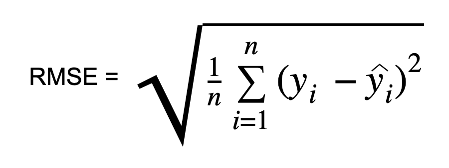
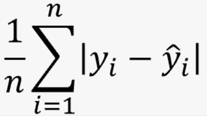

### **머신러닝 시스템의 종류**

#### 1. 지도학습(supervised learning)
* 알고리즘에 주입하는 훈련 데이터에 label이 포함
* 지도학습 알고리즘
  * k-최근접이웃(k-nearest neighbors)
  * 선형 회귀(Linear Regression)
  * 로지스틱 회귀(Logistic Regression)
  * 서포트 벡터 머신(SVM)
  * 결정 트리(Decision Tree)
  * 랜덤 포레스트(Random Forest)
  * 신경망(Neural Networks)
  
#### 2. 비지도학습(unsupervised learning)
* 알고리즘에 주입하는 훈련 데이터에 label이 미포함

### **파이프라인**
데이터 처리 컴포넌트(component)들이 연속되어 있는 것을 데이터 파이프라인(pipeline)이라고 한다. 
보통 컴포넌트들은 비동기적으로 동작한다.

 
 

### **성능 측정 지표 선택**
1. RMSE(root mean square error)

* n : RMSE를 측정할 데이터셋에 있는 샘플 수
* yi : 실제값
* y^i : 예측값 
RMSE의 경우, 주로 회귀 문제에 많이 사용된다.

1. MAE(mean absolute arror)

